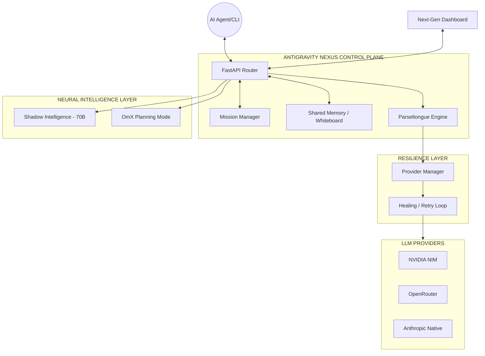
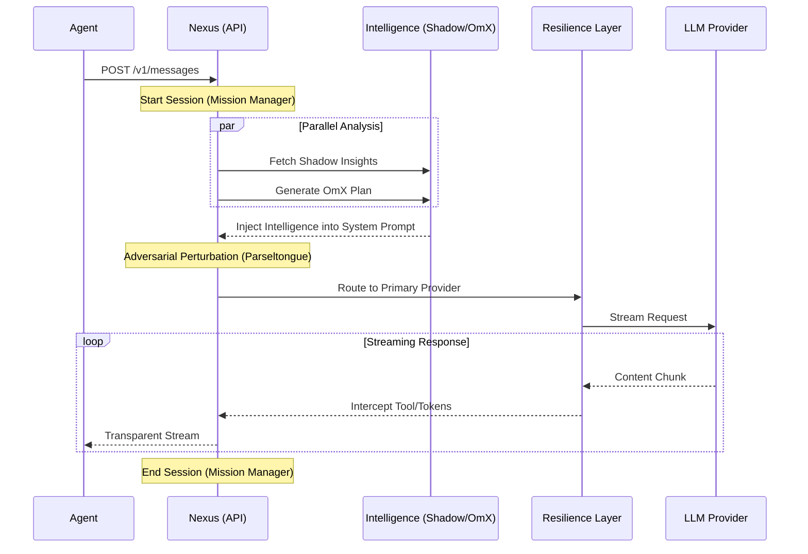
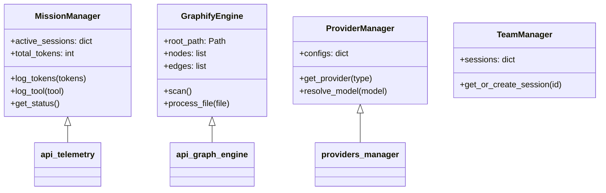

# ANTIGRAVITY NEXUS: VISUAL ARCHITECTURE

This document provides graphical representations of the system's neural pathways and component orchestration.

---

## 1. PROFESSIONAL ARCHITECTURAL SCHEMATIC

---

## 2. HIGH-LEVEL ARCHITECTURAL TOPOLOGY

The diagram below illustrates the core communication lines between the Agent, the Antigravity Nexus, and the Intelligence layers.

---

## 2. REQUEST ORCHESTRATION FLOW (STREAMING)

How a single message propagates through the system's neural layers.

---

## 3. COMPONENT RELATIONSHIP MAP

A structural view of the internal logic modules.

---

> [!TIP]
> These diagrams are rendered dynamically in any Markdown viewer supporting Mermaid (like GitHub or VS Code). For a professional architectural schematic in image format, please refer to the generated assets.
