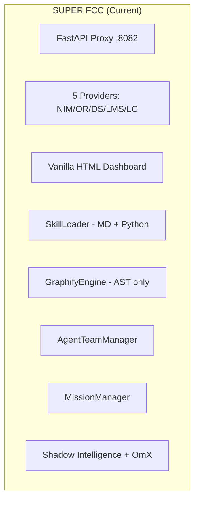

# Super FCC Merge & Upgrade Plan: AI Optimization & Cooperation

> **Goal**: Integrate the best capabilities from 8 reference repositories into the Super FCC project to create a unified, research-grade multi-agent orchestration platform.

---

## Reference Repository Analysis

| # | Repository | Tech | Key Capability | Merge Priority |
|---|-----------|------|----------------|----------------|
| 1 | **graphify** | Python (PyPI) | AST-based knowledge graph generation, multimodal extraction, Leiden clustering, MCP server | 🔴 HIGH |
| 2 | **antigravity-awesome-skills** | SKILL.md catalog | 1,435+ agentic skills, bundles, workflows, installer CLI | 🔴 HIGH |
| 3 | **everything-claude-code** | JS/TS Plugin | 183 skills, 48 agents, hooks, continuous learning, AgentShield security | 🟡 MEDIUM |
| 4 | **Antigravity-Manager** | Tauri/Rust + React | Multi-account pool, smart auto-switching, model routing, Imagen 3, Docker deploy | 🟡 MEDIUM |
| 5 | **AntigravityManager** | Electron + React/TS | Multi-account management, quota monitoring, local API proxy, VSCode extension | 🟢 LOW |
| 6 | **antigravity-claude-proxy** | Node.js | Anthropic→Google Cloud Code proxy, multi-account OAuth, web dashboard | 🟢 LOW |
| 7 | **opencode-antigravity-auth** | Node.js Plugin | Google OAuth for OpenCode, dual quota (Antigravity + Gemini CLI), account rotation | 🟢 LOW |
| 8 | **antigravity-agent** | Tauri + React/TS | Multi-account quick-switch desktop app, VSCode extension | ⚪ REFERENCE ONLY |

---

## Current Architecture Snapshot



---

## User Review Required

> [!IMPORTANT]
> **Google OAuth / Antigravity Provider**: Repositories #4, #5, #6, and #7 all use Google OAuth to proxy through Antigravity/Gemini. This carries **ToS violation risk** and accounts may be banned. Do you want Phase 4 (Google OAuth provider) included, or should we skip it entirely?

> [!WARNING]
> **Skill Volume**: The awesome-skills repo has 1,435+ skills. Importing all of them would bloat context. The plan proposes a **curated subset** (~50 high-value skills) plus a discovery API. Confirm this approach or specify a different threshold.

> [!IMPORTANT]
> **ECC Plugin Architecture**: Everything-Claude-Code uses a Claude Code plugin manifest system (`hooks.json`, `plugin.json`). Our project uses a Python-based SkillLoader. The plan proposes adapting ECC patterns to our Python skill format rather than adopting their JS plugin system. Confirm?

## Open Questions

1. **Graphify integration depth**: Should we replace our current `api/graph/engine.py` with the upstream `graphifyy` PyPI package, or keep our engine and selectively merge features (multimodal, Leiden clustering, MCP server)?

2. **Skill format**: Should we adopt the `SKILL.md` frontmatter format from awesome-skills as a first-class format alongside our existing Python skills?

3. **Model routing intelligence**: Antigravity-Manager has sophisticated tiered routing (Ultra/Pro/Free accounts, quota-aware scheduling, background task demotion to Flash models). How much of this logic should we absorb into our `ProviderManager`?

4. **Docker deployment**: Antigravity-Manager has production Docker support. Should we add Docker deployment to Super FCC?

---

## Proposed Changes

### Phase 1: Graphify Knowledge Graph Deep Integration
**Priority**: 🔴 HIGH | **Effort**: Large | **Risk**: Low

The upstream `graphify` project (12k+ stars) has evolved far beyond our basic AST engine. Key features to merge:

#### [MODIFY] [engine.py](file:///d:/Claude-Ultimate-Antigravity/api/graph/engine.py)
- **Leiden Community Detection**: Replace simple force-directed layout with Leiden clustering via `graspologic`
- **Confidence Tagging**: Add `EXTRACTED` / `INFERRED` / `AMBIGUOUS` tags to all edges
- **Cross-file Call Graph**: Expand from Python-only AST to 25-language support via `tree-sitter`
- **Rationale Extraction**: Parse `# NOTE:`, `# WHY:`, `# HACK:` comments as `rationale_for` nodes
- **Semantic Similarity Edges**: Use LLM extraction to detect cross-file conceptual links
- **Hyperedge Support**: Group 3+ node relationships

#### [NEW] `api/graph/mcp_server.py`
- Expose `graph.json` as an MCP server with `query_graph`, `get_node`, `get_neighbors`, `shortest_path` tools
- Register in our existing MCP config

#### [NEW] `api/graph/report_generator.py`
- Generate `GRAPH_REPORT.md` with god nodes, surprising connections, and suggested questions
- Serve via `/v1/graph/report` endpoint

#### [MODIFY] [app.py](file:///d:/Claude-Ultimate-Antigravity/api/app.py)
- Register new graph MCP server and report endpoints

#### [NEW] `pyproject.toml` dependency additions
```toml
# New dependencies for enhanced graphify
graspologic = ">=3.4"      # Leiden community detection
tree-sitter = ">=0.24"     # Multi-language AST
networkx = ">=3.4"         # Graph operations
```

---

### Phase 2: Awesome Skills Ecosystem Import
**Priority**: 🔴 HIGH | **Effort**: Medium | **Risk**: Low

#### [NEW] `skills/imported/` directory
- Curate and import ~50 high-value skills from awesome-skills, organized by category:
  - **Core Development**: `brainstorming`, `test-driven-development`, `debugging-strategies`, `code-review`
  - **Security**: `security-auditor`, `security-review`, `security-scan`
  - **Architecture**: `api-design-principles`, `hexagonal-architecture`, `architecture-decision-records`
  - **AI/Agent**: `autonomous-loops`, `continuous-learning-v2`, `iterative-retrieval`, `agent-eval`
  - **Operations**: `deployment-patterns`, `docker-patterns`, `database-migrations`
  - **Quality**: `verification-loop`, `eval-harness`, `lint-and-validate`

#### [MODIFY] [loader.py](file:///d:/Claude-Ultimate-Antigravity/api/skills/loader.py)
- Add `SKILL.md` frontmatter parser (YAML frontmatter with `name`, `description`, `category`, `risk`, `tags`)
- Support skill bundles (logical groupings)
- Add skill search/filter API by category, tags, risk level

#### [NEW] `api/skills/catalog.py`
- In-memory skill catalog with search, filter, and recommendation
- Serve via `/v1/skills/catalog` endpoint with query parameters
- Bundle support: pre-defined skill sets like "Security Engineer", "Full-Stack Developer"

#### [MODIFY] [routes.py](file:///d:/Claude-Ultimate-Antigravity/api/routes.py)
- Add `/v1/skills/catalog` and `/v1/skills/search` endpoints
- Add `/v1/skills/{skill_id}/content` to serve skill markdown

---

### Phase 3: ECC Harness Patterns Adoption
**Priority**: 🟡 MEDIUM | **Effort**: Large | **Risk**: Medium

Adapt the most valuable patterns from Everything-Claude-Code's 183 skills and agent architecture:

#### [NEW] `api/harness/` package
- **`continuous_learning.py`**: Instinct-based learning system
  - Extract patterns from session history
  - Confidence scoring (0.0-1.0) for learned instincts
  - Evolution: cluster related instincts into reusable skills
  
- **`session_memory.py`**: Session persistence hooks
  - Save/load context across proxy sessions
  - Strategic compaction suggestions (token budget management)
  
- **`quality_gate.py`**: Verification loop evaluation
  - Checkpoint vs continuous eval modes
  - Pass@k metrics for code generation quality

#### [NEW] `agents/` directory restructure
Adapt ECC's agent delegation pattern to our proxy architecture:
```
agents/
├── planner.md         # Feature implementation planning
├── architect.md       # System design decisions  
├── code_reviewer.md   # Quality and security review
├── security_reviewer.md # Vulnerability analysis
├── build_resolver.md  # Build error resolution
├── doc_updater.md     # Documentation sync
```

#### [MODIFY] [telemetry.py](file:///d:/Claude-Ultimate-Antigravity/api/telemetry.py)
- Add session-level pattern extraction hooks
- Add instinct storage and retrieval
- Add token budget tracking per session

#### [MODIFY] [manager.py](file:///d:/Claude-Ultimate-Antigravity/api/orchestration/manager.py)
- Add agent delegation support (route specific task types to specialized sub-agents)
- Add quality gate checkpoints between agent handoffs

---

### Phase 4: Multi-Account Pool & Advanced Provider
**Priority**: 🟡 MEDIUM | **Effort**: Large | **Risk**: HIGH (ToS concerns)

> [!CAUTION]
> This phase integrates Google OAuth patterns from references #4, #5, #6, #7. **All these projects warn about Google account bans.** Implement only if user explicitly opts in.

#### [NEW] `providers/antigravity/` package
- **`provider.py`**: New `AntigravityProvider(BaseProvider)` for Google Cloud Code
- **`oauth.py`**: Google OAuth2 flow with token refresh
- **`account_pool.py`**: Multi-account management
  - Round-robin, sticky, and hybrid account selection strategies
  - Automatic rotation on rate limit (429) or auth failure (401)
  - Per-account quota tracking and soft threshold protection
  - Dual quota system: Antigravity + Gemini CLI pools
- **`model_mapper.py`**: Map Claude model names to Gemini/Claude-via-Google equivalents

#### [MODIFY] [settings.py](file:///d:/Claude-Ultimate-Antigravity/config/settings.py)
```python
# New settings
ANTIGRAVITY_ACCOUNTS_FILE: str = ""  # Path to accounts JSON
ANTIGRAVITY_ACCOUNT_STRATEGY: str = "hybrid"  # round-robin | sticky | hybrid
ANTIGRAVITY_SOFT_QUOTA_THRESHOLD: int = 90  # Skip account at N% quota usage
ANTIGRAVITY_CLI_FIRST: bool = False  # Route Gemini to CLI quota first
```

#### [MODIFY] [manager.py](file:///d:/Claude-Ultimate-Antigravity/providers/manager.py)
- Register `antigravity` as a new provider prefix
- Add account pool lifecycle management

---

### Phase 5: Advanced Model Routing Intelligence
**Priority**: 🟡 MEDIUM | **Effort**: Medium | **Risk**: Low

Adopt the sophisticated routing patterns from Antigravity-Manager:

#### [MODIFY] [manager.py](file:///d:/Claude-Ultimate-Antigravity/providers/manager.py)
- **Tiered Routing**: Priority-based provider selection (prefer providers with higher quota refresh rates)
- **Background Task Demotion**: Auto-detect Claude CLI background requests (title generation, suggestions) and route to cheaper/faster models
- **Dynamic Model Specs**: Replace hardcoded model limits with a `model_specs.json` configuration file
- **Quota-Aware Scheduling**: Track per-provider quota and route to providers with remaining capacity

#### [NEW] `config/model_specs.json`
- Centralized model specification file with:
  - `max_output_tokens` per model
  - `supports_thinking` flag
  - `supports_tools` flag  
  - `rate_limit` defaults
  - `cost_per_1k_tokens` estimates

#### [MODIFY] [resilience.py](file:///d:/Claude-Ultimate-Antigravity/providers/resilience.py)
- Add quota-aware fallback selection (prefer providers with remaining quota)
- Add session-affinity support (prefer same provider for conversation continuity)
- Add model-level fallback chains (e.g., `gemini-3.1-pro-high` → `gemini-3.1-pro-low` → default)

---

## Implementation Priority Matrix

| Phase | Name | Priority | Dependencies | Est. Effort |
|-------|------|----------|-------------|-------------|
| 1 | Graphify Deep Integration | 🔴 HIGH | None | 3-4 days |
| 2 | Skills Ecosystem Import | 🔴 HIGH | None | 2-3 days |
| 3 | ECC Harness Patterns | 🟡 MEDIUM | Phase 2 (skill format) | 3-4 days |
| 4 | Multi-Account Provider | 🟡 MEDIUM | None | 4-5 days |
| 5 | Model Routing Intelligence | 🟡 MEDIUM | Phase 4 (optional) | 2-3 days |

**Recommended execution order**: Phase 1 → Phase 2 → Phase 5 → Phase 3 → Phase 4

> Phase 4 is last because of ToS risk and can be skipped entirely. Phase 5 before Phase 3 because routing intelligence has immediate value even without the harness patterns.

---

## Verification Plan

### Automated Tests
```bash
# After each phase
uv run ruff format
uv run ruff check  
uv run ty check
uv run pytest

# Phase 1 specific
uv run pytest tests/test_graph_engine.py -v

# Phase 2 specific  
uv run pytest tests/test_skill_loader.py -v
curl http://localhost:8082/v1/skills/catalog | python -m json.tool

# Phase 5 specific
uv run pytest tests/test_provider_manager.py -v
```

### Manual Verification
- **Phase 1**: Run `/v1/graph/data` and verify Leiden clusters appear in dashboard visualization
- **Phase 2**: Launch dashboard, navigate to Skills tab, verify imported skills appear with metadata
- **Phase 3**: Run a coding session and verify pattern extraction in session logs
- **Phase 5**: Configure mixed providers and verify quota-aware routing in server logs

### Browser Validation
- Dashboard renders enhanced neural map with community clusters
- Skills catalog page shows searchable/filterable skill library
- Telemetry shows session learning metrics
